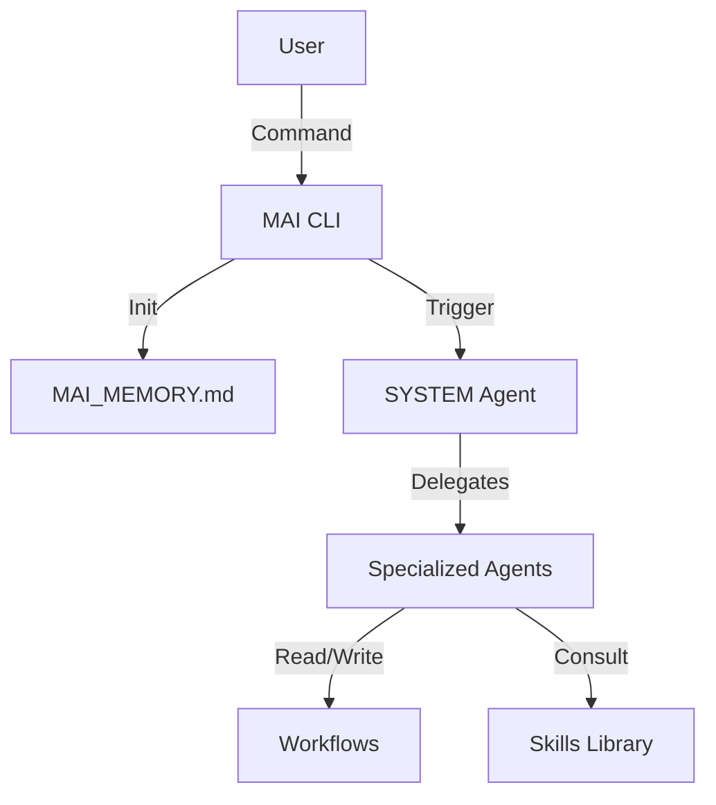

# 🤖 MAI Agents: Autonomous Digital Workforce


> **Scale your one-person team into a 20-person Enterprise Agency.**
> MAI Agents simulates a full professional software development team directly in your IDE.

---

## 🌟 Features

- **20 Specialized Agents:** From CEO to DevOps, get expert advice for every domain.
- **Structured Workflows:** Just like a real agency, we use `/brainstorm`, `/plan`, and `/execute` phases.
- **Active Memory:** The system remembers your project context, decisions, and stack via `MAI_MEMORY.md`.
- **Just-in-Time Design:** Smart detection of your brand's design system.
- **Bilingual Core:** Native support for **English** and **Turkish**.

---

## 🚀 Quick Start

### Installation

```bash
npm install -g mai-agents
```

### Initialization

Navigate to your project folder and run:

```bash
mai init
```

This will:
1.  Ask for your **Project Name**.
2.  Set your **Default Language** (TR/EN).
3.  Set your **Project Scale** (Startup/Enterprise).
4.  Scaffold the `mai-agent` architecture.

### Usage

Once installed, talk to your team using **Slash Commands**:

| Command | Action |
| :--- | :--- |
| **`/brainstorm`** | Round-table strategy meeting with C-Suite. |
| **`/party`** | Rapid development cycle (Plan -> Code -> Test). |
| **`/debug`** | Autonomous error analysis and fixing. |
| **`/test`** | Run security audits and unit tests. |
| **`/develop`** | **Ultimate Mode:** End-to-end feature delivery. |

---

## 📚 Documentation

Detailed guides can be found in the [`docs/`](docs/) directory:

- [📖 **Introduction**](docs/introduction.md) - Philosophy and Core Concepts.
- [⬇️ **Installation**](docs/installation.md) - CLI and Git setup guides.
- [🎮 **Usage & Workflows**](docs/usage.md) - Detailed breakdown of commands.
- [👥 **Agent Roster**](docs/agents.md) - Meet the team (CEO, CTO, Dev, etc.).
- [⚙️ **Configuration**](docs/configuration.md) - Customizing Memory and Branding.

---

## 🏗️ Architecture

MAI Agents follows a strict **Clean Architecture** and **SOLID** principles.



---

## 📜 License

MIT License. Created by **MAI Agents Corp**.
