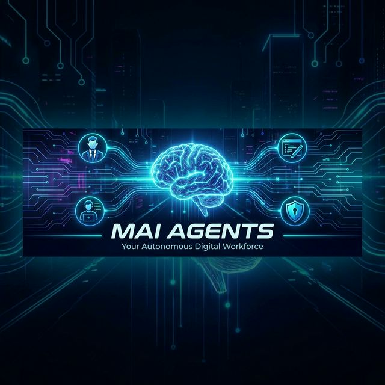

# � MAI Agents: The Autonomous Digital Workforce



> **"Scale your one-person operation into a 20-person Enterprise."**
>
> MAI Agents isn't just a CLI tool; it's a **Neuro-Symbolic Workforce Framework** that integrates directly into your terminal and workflow. It simulates a full C-Suite and Engineering team to help you Brainstorm, Plan, Code, Debug, and Ship faster than ever before.

---

## ⚡ Why MAI Agents?

- **🚀 Instant C-Suite:** Access a CEO, CTO, CPO, and 17 other specialized agents with one command.
- **💬 Interactive:** Talk to your agents via the CLI (`mai brainstorm`) or Chat Prompts (`/brainstorm`).
- **🧠 Active Memory:** The system maintains `MAI_MEMORY.md`, a living document of your project's context, decisions, and tech stack.
- **🔗 Drop-in Integration:** Works in **ANY** project (Next.js, Python, Flutter). Just run `mai init` and deploy your team.

---

## 🚀 Quick Start

### 1. Installation

```bash
# Clone or Link
npm install -g mai-agents
```

### 2. Turn Key (Init)

Navigate to your project (new or existing) and wake up the agents:

```bash
mai init
```
* **Options:**
    * "Create New Project" (Scaffolds a fresh folder)
    * "Integrate into Current Project" (Adds agents to your existing repo safe & sound)

---

## 🎮 Interactive Commands

Once initialized, your team is ready. No complex configs. Just lead.

### 🧠 **Strategic Brainstorming**
Gather your Executives (CEO, CTO, CMO) to discuss a new idea.
```bash
mai brainstorm "AI-Powered Personal Finance Tracker"
```
> *Result: A strategic report covering Feasibility, ROI, and Roadmap.*

### 🥳 **Party Mode (Rapid Dev)**
The "Get It Done" button. Spec -> Code -> Test cycle in one go.
```bash
mai party "Implement OAuth2 Login with Google"
```
> *Result: User Stories, Tech Specs, Code, and QA Verdict.*

### 🐞 **Neural Debugging**
Stuck? Let the squad analyze the stack trace.
```bash
mai debug "Error: 500 Internal Server Error in /api/payment"
```
> *Result: Root Cause Analysis (RCA) and patched code.*

### 🧪 **Stress Testing**
Simulate attacks and load.
```bash
mai test "Payment Gateway Module"
```

### 🎭 **Crisis Simulation**
Prepare for the worst.
```bash
mai scenario "AWS Region US-East-1 is DOWN"
```

---

## 🏢 The Agent Roster

MAI Agents simulates the following departments:

| Department | Agents | Focus |
| :--- | :--- | :--- |
| **Executive** | `[CEO]`, `[CTO]`, `[CPO]`, `[COO]` | Strategy, Budget, Vision |
| **Product** | `[UXR]`, `[CDO]`, `[PM]` | User Research, Design, Roadmap |
| **Engineering** | `[ARCHITECT]`, `[DEV]`, `[QA]`, `[MOBILE]` | Code, Architecture, Quality |
| **Growth** | `[CMO]`, `[SOCIAL]`, `[CRO]` | Marketing, Revenue, Content |
| **Ops/Sec** | `[DEVOPS]`, `[CISO]` | Infrastructure, Security |

---

## 📂 Project Structure

When you run `mai init`, we add the following "Brain Stem" to your project:

```
my-app/
├── MAI_MEMORY.md       # 🧠 The Active Brain (Context & State)
├── MAI_README.md       # 📖 Usage Instructions (If README exists)
├── .agents/            # 👥 Agent Personas & Prompts
├── workflows/          # ⚡ Agent Protocols (Brainstorm, Party, etc.)
└── ... (your files)
```

---

## 📜 Principles

MAI Agents operates on strict **Senior Architect** standards:
1.  **Clean Architecture Only:** No spaghetti code.
2.  **Neuro-Marketing:** Every feature must have a "hook".
3.  **Fail-Safe:** Error boundaries are mandatory.
4.  **Universal Memory:** Context is never lost.

---

## ⭐️ License

MIT License. Created by **MAI Agents Corp**.
