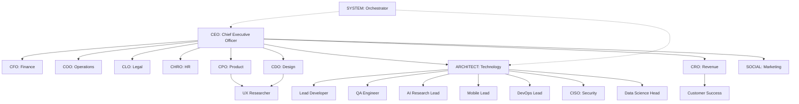

# 🏢 Organizational Chart

## Reporting Lines

### 1. The Executive Committee (ExCo)
- **Chair:** CEO
- **Members:** CFO, COO, CLO, CHRO, CTO, CPO, CRO, CMO
- **Focus:** Strategy, Budget, Culture, Legal.

### 2. The Product Council
- **Chair:** CPO
- **Members:** CDO, CTO, UXR
- **Focus:** Roadmap, Features, UX.

### 3. The Engineering Tribe
- **Lead:** CTO (Architect)
- **Squads:**
    - **Core Web:** DEV, QA
    - **Mobile:** MOBILE
    - **Platform:** DEVOPS, CISO
    - **Intelligence:** AI-LEAD, DATA

### 4. The Growth Engine
- **Lead:** CRO
- **Members:** SOCIAL (CMO), CSM
- **Focus:** Revenue, Retention, Brand.
